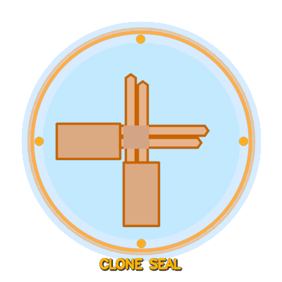

<p align="center">
  
</p>

<h1 align="center">🥷 Shadow Clone AR</h1>

<p align="center">
  <b>Kage Bunshin no Jutsu — but make it ✨ real life ✨</b>
</p>

<p align="center">
  
  
  
  
  
</p>

---

## 🍥 What is this?

Ever watched Naruto and thought _"Man, I wish I could do that"_?

**Well now you can.** (Sort of.)

This app uses your **webcam + AI** to detect when you make the **Shadow Clone hand seal** ✌️🤞 and then spawns **12 real-time clones** of yourself behind you — just like the real jutsu.

> _"The Shadow Clone Jutsu creates physical copies of the user."_
> — Third Hokage, probably scrolling through GitHub

---

## 🎬 How it Works

```
You: *makes hand seal*

App: 🔊 *success chime*
     ✨ "KAGE BUNSHIN NO JUTSU!" ✨
     💨 *poof*
     
     🧍🧍🧍🧍🧍
    🧍🧍 YOU 🧍🧍
     🧍🧍🧍🧍🧍
     
You: 😮
```

### The Pipeline

```
📷 Webcam Frame
     │
     ▼
🖐️ MediaPipe Hands ──► "Are fingers crossed?" ──► YES!
     │                                              │
     ▼                                              ▼
🔊 Play Sound                              🎭 Selfie Segmentation
                                                    │
                                                    ▼
                                            ✂️ Cut out your body
                                                    │
                                                    ▼
                                        📋 Copy & paste 12 times
                                                    │
                                                    ▼
                                         🖼️ Layer everything
                                         (clones behind, you in front)
                                                    │
                                                    ▼
                                              🥷 SHADOW CLONES!
```

---

## 🚀 Quick Start

### 1. Clone this repo (pun intended)
```bash
git clone https://github.com/yourusername/ShadowCloneAR.git
cd ShadowCloneAR
```

### 2. Create virtual environment
```bash
python -m venv venv
venv\Scripts\activate          # Windows
# source venv/bin/activate     # Mac/Linux
```

### 3. Install dependencies
```bash
pip install -r requirements.txt
```

### 4. Generate assets (first time only)
```bash
python generate_sounds.py
python generate_hand_seal.py
```

### 5. Run the jutsu
```bash
python main.py
```

### 6. Make the hand seal and BELIEVE IT! 🍥

---

## 🎮 Controls

| Key | Action | Naruto Equivalent |
|:---:|--------|-------------------|
| ✌️🤞 | Make the cross hand seal | Performing the jutsu |
| `D` | Dismiss all clones | Releasing the jutsu |
| `Q` | Quit | Going home to eat ramen |

---

## 🧠 The "Jutsu" Detection Algorithm

The app doesn't just look for _any_ hand gesture. It specifically detects the **Shadow Clone cross seal**:

```
         ┌──── Index finger
         │ ┌── Middle finger
         ▼ ▼
    ╔═══╗╔═══╗
    ║ ✌ ║║ ✌ ║
    ╚═══╝╚═══╝
      ╲    ╱
       ╲  ╱     ← Hands crossing!
        ╲╱
        ╱╲
       ╱  ╲
    ╔═══╗╔═══╗
    ║ ✊ ║║ ✊ ║  ← Ring + Pinky curled
    ╚═══╝╚═══╝
```

**Three conditions must be met:**
1. ✅ Two hands detected
2. ✅ Index + Middle fingers **extended**, Ring + Pinky **curled**
3. ✅ Finger tips of one hand near the knuckles of the other (the actual **cross**)

---

## 🛠️ Tech Stack

| Tech | Role | Why |
|------|------|-----|
| **Python** | Language | Because ninjas use snakes 🐍 |
| **OpenCV** | Video & Image | The eyes of the operation 👁️ |
| **MediaPipe** | Hand + Body AI | Google's ninja detector 🤖 |
| **NumPy** | Pixel math | Shifting clones at the speed of light ⚡ |
| **winsound** | Sound effects | *poof* 💨 |

---

## 📁 Project Structure

```
ShadowCloneAR/
├── 🥷 main.py                  # The main jutsu
├── 🔊 generate_sounds.py       # Creates sound effects
├── 🖼️ generate_hand_seal.py    # Creates the hand seal guide
├── 📦 requirements.txt         # Ninja tools needed
├── 📋 projectdetails.txt       # The sacred scroll
├── 🙈 .gitignore               # What stays hidden
│
└── 📂 assets/
    ├── 🖼️ hand_seal.png        # The seal reference image
    └── 📂 sounds/
        ├── 🔔 success.wav      # "Jutsu activated!"
        └── 💨 poof.wav         # *clone appears*
```

---

## ⚠️ Troubleshooting

| Problem | Solution |
|---------|----------|
| Camera not detected | Settings → Privacy → Camera → Enable "Desktop apps" access |
| `mediapipe has no attribute 'solutions'` | Use `mediapipe==0.10.14` (pinned in requirements.txt) |
| Clones look weird | Make sure you have good lighting 💡 |
| Jutsu not detecting | Try making the cross seal more exaggerated 🤞✌️ |
| Too many clones | That's not a bug, that's a feature 🥷🥷🥷 |

---

## 🍜 Fun Facts

- Naruto's Shadow Clone Jutsu is a **B-rank kinjutsu** (forbidden technique)
- The real jutsu splits your chakra equally among clones — this app splits your **CPU** equally 😅
- Naruto once created **~1000 clones**. Your laptop can do 12. We're getting there.
- No ramen was harmed in the making of this project 🍥

---

## 🤝 Contributing

Found a bug? Want to add the **Rasengan** next? Feel free to open a PR!

Just remember the ninja way:
> _"I'm not gonna run away. I never go back on my word. That's my nindo — my ninja way!"_

---

## 📜 License

Do whatever you want with it. Just don't use it for evil jutsu. 🥷

---

<p align="center">
  <b>Made with 🍥 and a mass of shadow clones</b>
  <br><br>
  <i>"Believe it!" — Naruto Uzumaki</i>
</p>
